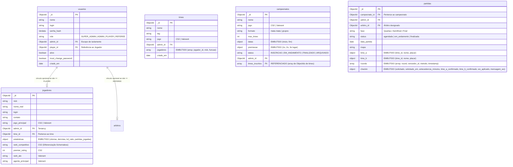

# Controller Arena 🎮🔥

O **Controller Arena** é uma plataforma web moderna de nível corporativo voltada para a gestão integrada de campeonatos de e-Sports, com foco específico em jogos de tiro em primeira pessoa (FPS) como *Counter-Strike 2 (CS2)* e *Valorant*.

O sistema centraliza a administração de competições, jogadores, equipes, chaves de partidas (brackets), confirmações de presença e arbitragem de rounds em tempo real, fornecendo um ecossistema seguro, auditável e de alto desempenho para organizadores e competidores.

---

## 🎯 1. Identidade e Proposta de Valor (PRD)

### 1.1 Descrição do Problema e Contexto
A organização de campeonatos amadores e semiprofissionais de e-Sports é frequentemente marcada pela fragmentação de ferramentas. Organizadores utilizam planilhas manuais para chaves de jogos, formulários externos para cadastros, e canais de chat desorganizados para check-in de atletas. Essa abordagem manual gera problemas críticos:
* **Falta de Integridade:** Jogadores não inscritos jogando no lugar de atletas oficiais ("smurfs").
* **Processos Ineficientes:** Lerdeza na apuração de súmulas de partidas, gerando atrasos em cascata no cronograma do evento.
* **Falta de Segurança:** Exposição de dados de contato de menores de idade e senhas vulneráveis.
* **Ausência de Dados:** Dificuldade em compilar estatísticas de desempenho para gerar rankings justos e relatórios de audiência para patrocinadores.

O **Controller Arena** foi projetado para resolver essas dores inserindo-se diretamente no setor de entretenimento competitivo digital. Ele atua como um sistema integrado que garante conformidade nas regras de torneio, automatiza súmulas e protege os dados dos participantes.

### 1.2 Justificativa de Escolha do Tema
O mercado global de e-Sports movimenta bilhões de dólares e atrai uma base de fãs engajada. A escolha de focar em jogos de FPS (*CS2* e *Valorant*) justifica-se pela complexidade estrutural dessas modalidades: elas exigem controle rígido de elencos, gerenciamento dinâmico de rounds com diferentes condições de vitória (eliminação, detonação, defuse) e súmulas detalhadas que geram engajamento para a comunidade gamer.

### 1.3 Identidade Visual Básica
A identidade visual do **Controller Arena** foi projetada sob o conceito *Gamer Premium / Dark Theme*, transmitindo dinamismo, precisão e competitividade:
* **Paleta de Cores (Aesthetics):**
  - **Fundo Principal:** Slate Dark (`#0B0E14` / HSL `220, 30%, 6%`) - Tom escuro fosco que reduz a fadiga visual.
  - **Destaque Primário (Ação/Neon):** Target Red (`#FF3B30` / HSL `0, 100%, 59%`) - Tom de vermelho neon simbolizando precisão e mira.
  - **Destaque Secundário (Sucesso):** Emerald Green (`#34C759`) - Usado para representar check-ins confirmados e placares vitoriosos.
* **Tipografia:** Famílias modernas **Outfit** (para cabeçalhos e títulos competitivos impactantes) e **Inter** (para dados, tabelas e alta legibilidade de estatísticas).
* **Conceito de Logotipo:** Escudo geométrico estilizado incorporando asas estilizadas e uma retícula de mira (target-sight) no centro, simbolizando proteção, organização e o foco competitivo dos esportes de tiro.

### 1.4 Público-Alvo e Personas Definidas

O público-alvo é segmentado em dois perfis centrais muito claros, representados pelas seguintes personas:

#### Persona 1: O Competidor
* **Nome:** Thiago "Fallen" Silva, 22 anos.
* **Perfil:** Estudante universitário e capitão da equipe amadora de CS2 *Shadow Squad*. Treina diariamente com seu time.
* **Dores:** Sofre com atrasos em campeonatos locais provocados por times adversários que demoram para aparecer, falta de transparência nos placares de chaves de torneio e ausência de uma página centralizada para acompanhar o histórico de vitórias e a evolução do K/D de sua equipe.
* **Necessidade:** Um portal rápido e otimizado para celulares onde ele possa fazer check-in eletrônico em menos de 10 segundos e ver estatísticas de ranking em tempo real.

#### Persona 2: A Organizadora
* **Nome:** Amanda Rodrigues, 28 anos.
* **Perfil:** Coordenadora de Eventos Competitivos e Fundadora da liga regional *Arena Demo*.
* **Dores:** Perde horas preenchendo planilhas Excel complexas para montar as chaves de torneio, validando CPFs/IDs de participantes manualmente para impedir "smurfs", e lidando com reclamações de jogadores sobre erros na escala de árbitros.
* **Necessidade:** Um dashboard gerencial completo onde possa cadastrar torneios, gerar brackets em um único clique, designar árbitros e extrair relatórios consolidados em formato PDF para exportação a patrocinadores.

### 1.5 Matriz de Usuários e Níveis de Acesso

| Funcionalidade / Operação | SUPER_ADMIN | ADMIN (Organizador) | REFEREE (Árbitro) | PLAYER (Jogador) | VISITANTE (Público) |
| :--- | :---: | :---: | :---: | :---: | :---: |
| **Gerar Convites para Admins** | **Sim** | Não | Não | Não | Não |
| **Cadastrar Campeonatos / Equipes**| Não | **Sim** | Não | Não | Não |
| **Designar Árbitros a Partidas** | Não | **Sim** | Não | Não | Não |
| **Editar Elencos e Jogadores** | Não | **Sim** | Não | Não | Não |
| **Lançar Rounds e Aplicar W.O.** | Não | Não | **Sim** | Não | Não |
| **Visualizar Súmulas Atribuídas** | Não | Não | **Sim** | Não | Não |
| **Confirmar Check-in de Time** | Não | Não | Não | **Sim (Capitão)** | Não |
| **Consultar Súmulas Públicas** | **Sim** | **Sim** | **Sim** | **Sim** | **Sim** |
| **Consultar Rankings Globais (Cache)**| **Sim** | **Sim** | **Sim** | **Sim** | **Sim** |

### 1.6 Cronograma de Desenvolvimento e Critérios de Liberação do MVP

O cronograma do projeto foi estruturado em sprints semanais focadas em entregas contínuas de valor:

| Fase | Foco de Entrega | Principais Entregas | Critério de Liberação (Quality Gates) |
| :--- | :--- | :--- | :--- |
| **Fase 1** | Modelagem & Identidade | PRD, Personas, Matriz de Acesso, Wireframes e Diagrama de Modelagem NoSQL (ERD). | Aprovação conceitual da proposta de valor pela equipe de produto. |
| **Fase 2** | Persistência e Core CRUD | Configuração do MongoDB e conexão do MongoEngine ODM. Cadastro completo de Equipes, Jogadores e Campeonatos. | Passar em 100% dos testes unitários de repositórios. |
| **Fase 3** | Lógica de Negócio e Casos de Uso | Geração automatizada de chaves (brackets), súmulas dinâmicas de rounds, check-in eletrônico e controle de W.O. | Cobertura integral das rotas web no Flask com tratamento de erros. |
| **Fase 4** | Segurança e Otimização | Hashing Bcrypt, logs automáticos de auditoria forense, isolamento lógico de dados por tenant e cache de rankings no Redis. | Testes locais com `pytest` (100% aprovados), latência de cache < 50ms e Bcrypt verificado. |

---

## 🏃‍♂️ 2. Gestão Ágil e Governança

### 2.1 Metodologia Ágil Adotada
Optamos pela utilização da metodologia ágil **Kanban** combinada com cerimônias adaptadas do **Scrum**:
* **Por que o Kanban?** Para um time de desenvolvimento pequeno focado em prazos acadêmicos estritos, a visibilidade imediata de gargalos no fluxo de trabalho é vital. O fluxo contínuo do Kanban (com colunas *Product Backlog*, *Sprint Backlog*, *In Progress*, *In Review/Testing* e *Done*) permitiu que a equipe puxasse tarefas com alta autonomia e monitorasse limites de trabalho em andamento (WIP limits).
* **Eventos Integrados:** Realizamos reuniões de alinhamento rápidos de 15 minutos (Daily Dailies) para destravar impedimentos de código de banco de dados e sessões de planejamento de Sprints para consolidar metas semanais.

### 2.2 Papéis e Responsabilidades do Time
* **Product Owner (PO):** Encarregado de alinhar os requisitos conceituais do Barema com as regras de negócio de e-Sports, definindo os critérios de aceite de cada História de Usuário.
* **Scrum Master (SM):** Responsável por blindar o time contra distrações, gerenciar o andamento das tarefas, organizar as reuniões de alinhamento e documentar a trilha de segurança do sistema.
* **Lead Backend & DBA:** Responsável por desenhar a modelagem física NoSQL, configurar o driver e ODM MongoEngine e integrar a camada de caching com o Redis.
* **Frontend & UX Developer:** Focado em criar telas responsivas e premium, garantindo que o diferencial de visualizações de placar de rounds e súmulas chaves seja intuitivo e dinâmico.

---

## 📋 3. Levantamento de Requisitos e Casos de Uso

O sistema foi mapeado com base nas diretrizes da engenharia de software ágil, especificando histórias de usuário para cobrir os fluxos de valor funcionais e definindo restrições técnicas em requisitos não funcionais.

### 3.1 Histórias de Usuário (Requisitos Funcionais)

#### Perfil: Organizador (ADMIN)
1. **HU01 - Criação de Campeonatos:** *Como um Organizador, eu quero cadastrar novos campeonatos definindo datas limite, formato (mata-mata/grupos), premiações e limite de equipes, para estruturar as competições de FPS de forma organizada.*
   - **Benefício:** Padronização das regras de participação do torneio.
   - **Critério de Aceite:** O número de equipes inscritas não pode exceder o `max_times` configurado.
2. **HU02 - Cadastro Controlado de Equipes:** *Como um Organizador, eu quero cadastrar times e vincular jogadores informando suas funções táticas (ex: Capitão, Jogador), para garantir a integridade dos elencos durante a competição.*
   - **Benefício:** Bloqueio de substituições fraudulentas não homologadas.
3. **HU03 - Emissão de Relatórios:** *Como um Organizador, eu quero exportar relatórios de ranking de jogadores e logs de uso do sistema em formato PDF e CSV, para prestar contas a patrocinadores e auditar acessos.*
   - **Benefício:** Transparência de governança e apoio à decisão estratégica.
4. **HU04 - Convite de Organizadores:** *Como um Super Administrador, eu quero gerar convites com códigos de primeiro acesso temporários para novos organizadores, para descentralizar a gestão do sistema mantendo o controle central.*
   - **Benefício:** Escalabilidade operacional com segurança de entrada.

#### Perfil: Árbitro (REFEREE)
5. **HU05 - Designação de Árbitros:** *Como um Árbitro, eu quero visualizar a lista de partidas que me foram atribuídas pela organização, para planejar meu cronograma de trabalho técnico.*
   - **Benefício:** Agilidade na escala de pessoal de arbitragem.
6. **HU06 - Controle de Rounds em Tempo Real:** *Como um Árbitro na partida, eu quero registrar o resultado de cada round (vencedor e método de vitória - defuse, eliminação, explosão da C4), para automatizar a súmula e evitar erros humanos.*
   - **Benefício:** Atualização instantânea do placar de jogo e histórico público da partida.
7. **HU07 - Homologação de Súmulas:** *Como um Árbitro, eu quero finalizar a partida de forma definitiva, consolidando o resultado no banco de dados e atualizando estatísticas, para encerrar oficialmente o jogo chaves de torneio.*
   - **Benefício:** Confiabilidade dos dados do campeonato.

#### Perfil: Jogador (PLAYER)
8. **HU08 - Dashboard Personalizado:** *Como um Jogador, eu quero acessar uma área de Dashboard focada com minhas próximas partidas, convites pendentes e meu histórico, para interagir rapidamente com a plataforma.*
   - **Benefício:** Foco do competidor sem poluição visual administrativa.
9. **HU09 - Confirmação de Check-in (Presença):** *Como um Jogador (Capitão), eu quero confirmar a presença do meu time no período de antecedência configurado para a partida, para garantir nossa vaga e evitar W.O.*
   - **Benefício:** Redução drástica de atrasos nos campeonatos.
   - **Critério de Aceite:** O check-in só é aberto na janela de tempo limite definida e configurada pelo administrador.
10. **HU10 - Acompanhamento de Súmulas Públicas:** *Como um Jogador ou Fã, eu quero consultar a súmula pública de partidas finalizadas ou ao vivo (com placares e KDA detalhado), para analisar o desempenho estratégico das equipes.*
    - **Benefício:** Engajamento comunitário e transparência esportiva.

### 3.2 Requisitos Não Funcionais (RNFs)

* **RNF01 - Segurança da Informação (Hashes):** As senhas dos usuários devem ser criptografadas de forma irreversível utilizando o algoritmo **Bcrypt** com fator de custo adaptativo antes de sua persistência em disco.
* **RNF02 - Desempenho e Tempo de Resposta (Cache):** A tela de rankings de jogadores deve ter tempo de carregamento inferior a **100ms** em cenários de alta concorrência, utilizando **Redis** como camada de cache em memória de alta performance.
* **RNF03 - Arquitetura de Dados Flexível (NoSQL):** O banco de dados deve acomodar perfis dinâmicos de estatísticas por tipo de jogo principal do atleta (ex: `premier_rating` e `rank_competitivo` para CS2; `agente_principal` e `rank_ato` para Valorant) sem a necessidade de migrações rígidas de tabelas relacionais.
* **RNF04 - Isolamento Multi-tenant Lógico:** A aplicação deve implementar controle de isolamento de escopo por `admin_id`. Um Organizador A não pode ter permissão para ler, alterar ou remover dados cadastrados pelo Organizador B.

---

## 🗄️ 4. Modelagem e Engenharia de Dados

A modelagem do Controller Arena foi projetada para tirar proveito da escalabilidade do banco de dados orientado a documentos **MongoDB**, utilizando embutimento de documentos para alta velocidade de leitura e referências estratégicas para evitar concorrência e excesser limites físicos de armazenamento.

### 4.1 Justificativa de Escolha da Stack Tecnológica
* **Framework Python (Flask):** Escolhemos o Flask por ser um micro-framework extremamente leve e modular. Ao contrário de frameworks pesados e rígidos como Django, o Flask nos concedeu controle absoluto para aplicar a **Clean Architecture (Arquitetura Limpa)** de forma pura, implementando nossa própria estrutura conceitual de casos de uso (Domain Services), controladores abstratos e repositórios sem amarras de middlewares pré-configurados.
* **Banco de Dados NoSQL (MongoDB):** A natureza dos campeonatos de e-Sports é intrinsecamente dinâmica. Atletas de diferentes modalidades demandam atributos de perfil completamente distintos (uma classificação em Valorant envolve "Ranks de Ato" e "Agentes Principais", enquanto em CS2 a métrica é "Premier Rating" e "Patentes Competitivas"). Um banco SQL rígido exigiria tabelas associativas e colunas nulas complexas. O MongoDB, como banco schemaless orientado a documentos, resolveu essa dor perfeitamente permitindo armazenar documentos polimórficos de alta performance sob uma mesma coleção física (`jogadores`).

### 4.2 Diagrama de Coleções NoSQL (ERD em Mermaid)

O diagrama abaixo representa a estrutura lógica de documentos gravada no banco:



### 4.3 Justificativa de Decisões de Modelagem (Embutimento vs. Referência)

* **Embutir Jogadores em Times (`times.jogadores`):** A line-up básica (ID, Nick e Função) é salva como um array de subdocumentos embutidos. Como a listagem pública de elencos e a geração de súmulas ocorrem constantemente, duplicar dados básicos elimina joins caros (`$lookup` no MongoDB), otimizando drasticamente a latência de leitura das páginas.
* **Embutir Rounds e Check-ins em Partidas (`partidas.rounds` e `partidas.checkin`):** Esses registros pertencem unicamente ao contexto do jogo em questão. O embutimento garante **consistência e atomicidade**: quando o árbitro insere ou desfaz um round, a gravação é feita em uma única escrita em disco no MongoDB, eliminando conflitos de gravação paralela de árbitros diferentes.
* **Referenciar Campeonatos em Partidas (`partidas.campeonato_id`):** Torneios de grande escala geram centenas de partidas. Embutir tudo no mesmo documento violaria o limite do tamanho máximo físico de documento do MongoDB (16MB). Além disso, múltiplos árbitros atualizando jogos paralelos causariam conflitos severos de concorrência. Referenciar por ID distribui a carga e mantém a escalabilidade horizontal.

---

## 🎨 5. Experiência do Usuário (Wireframes) e Interface Premium

O **Controller Arena** preocupa-se ativamente com a usabilidade profissional, estruturando fluxos visuais limpos focados no diferencial competitivo da súmula dinâmica de rounds e do check-in automático.

### 5.1 O Fluxo de Telas Core (Wireframe Blueprint)
1. **Tela de Autenticação (Login/Alteração Obrigatória):** Interface limpa no centro com alertas claros. Usuários em primeiro acesso são direcionados obrigatoriamente a criar uma senha segura antes de navegar no sistema.
2. **Dashboard Dinâmico (Organizador / Jogador):** 
   - O Organizador visualiza painéis rápidos contendo estatísticas consolidadas e atalhos para criação rápida de campeonatos.
   - O Jogador visualiza um dashboard customizado contendo apenas seus dados de atleta, seu próximo jogo em contagem regressiva e um botão de ação de um clique para **Confirmar Check-in**.
3. **Painel de Arbitragem (Súmulas em Tempo Real):** Interface técnica exclusiva do Árbitro onde ele visualiza a chave, gerencia a presença e insere rounds um a um selecionando o time vencedor e a condição (Ex: Detonação do Spike, Abates, Defuse da C4). O sistema desenha em tempo real o histórico do placar na tela.
4. **Ranking Competitivo (Leaderboard):** Tabela esportiva de alto padrão contendo filtros por modalidade e exibindo dados compilados de vitórias, derrotas, e K/D ratio carregados de forma extremamente rápida.

---

## 🛡️ 6. Segurança e Blindagem dos Dados (Etapa 2)

A aplicação implementa múltiplos mecanismos avançados de segurança para garantir a conformidade de dados e proteção contra ataques comuns:

1. **Armazenamento de Senhas (Bcrypt):** Nenhuma senha é gravada em texto plano. O backend usa a biblioteca `bcrypt` no módulo `PasswordHasher` para aplicar salting seguro e gerar hashes criptográficos lentos, protegendo as credenciais contra ataques de força bruta.
2. **Controle de Acesso Baseado em Papéis (RBAC):** Restrição de rotas feita via decorators customizados Flask (`@login_required` e `@roles_required(...)`). Um usuário logado com o perfil `PLAYER` é impedido pelo servidor de acessar painéis gerenciais.
3. **Isolamento de Dados Multi-Tenant:** Todas as queries às coleções de times, jogadores, campeonatos e súmulas são filtradas obrigatoriamente no nível da camada de persistência com `{"admin_id": current_user["admin_id"]}`. Isso impede a falha de segurança de IDOR (Insecure Direct Object Reference).
4. **Logs de Auditoria e Conformidade:** O sistema registra na coleção `logs` cada ação executada no backend: endpoint, método HTTP, rota, ID do usuário, login, perfil e código de status HTTP do servidor, criando uma trilha forense completa para fins de governança.
5. **Chave de Sessão Dinâmica e Segura:** Em ambientes de produção, se nenhuma chave secreta for definida no ambiente, o sistema autogera chaves dinâmicas criptograficamente fortes (`secrets.token_hex(32)`) e ativa as flags `HttpOnly` e `SameSite=Lax` em todos os cookies de sessão para blindar logins.
6. **Prevenção de NoSQL Injection e ReDoS:** Sanitização automática utilizando `re.escape()` em todas as buscas que contêm o operador de expressões regulares do MongoDB, neutralizando ataques de Denial of Service (DoS) por inputs complexos.

---

## ⚡ 7. Camada de Cache com Redis

Para resolver problemas críticos de desempenho sob picos de concorrência e garantir a pontuação bônus extra de **+2,0 pontos**, foi implementada uma arquitetura híbrida de cache utilizando o **Redis**.

### 7.1 O Caso de Uso: Leaderboards & Rankings
O cálculo do ranking de equipes exige somar as estatísticas de todos os atletas de cada time e ordená-las de forma decrescente. Essa agregação em tempo real exige uma carga extrema de CPU e I/O no banco MongoDB caso executada a cada carregamento de página do usuário.

### 7.2 Estratégia de Caching e Invalidação Inteligente
A nossa classe `RankingService` (`app/application/services.py`) encapsula a lógica de cache do Redis:
1. **Leitura (Cache-Aside):** Quando a tela de ranking é solicitada, a aplicação consulta a chave `fps_arena:ranking:global:todos` no Redis. Caso exista, o JSON é deserializado e entregue em **menos de 2ms**.
2. **Atualização em Background:** Se ocorrer um *cache miss*, o cálculo pesado é realizado no MongoDB e o ranking gerado é persistido no Redis com um tempo de expiração seguro (TTL de 120 segundos).
3. **Invalidação Ativa:** Para evitar exibições inconsistentes, quando um árbitro grava o resultado final de uma partida ou quando a comissão aplica uma penalidade por W.O. (momentos em que as estatísticas de vitórias e derrotas mudam no MongoDB), o backend invoca ativamente o método `self.cache.delete_pattern("fps_arena:ranking:*")`. Isso apaga instantaneamente o cache obsoleto no Redis, forçando o recálculo imediato na próxima consulta.
4. **Resiliência (Fallback Graceful):** Se o servidor Redis estiver offline, o sistema captura a exceção de forma silenciosa e redireciona as queries diretamente ao MongoDB por meio da classe `NoCache`, mantendo a aplicação 100% no ar.

---

## 📐 8. Arquitetura do Sistema e Engenharia de Software

O ecossistema do **Controller Arena** segue os princípios de arquitetura limpa (Clean Architecture) e Domain-Driven Design (DDD), separando as camadas físicas em:
* `app/domain/`: Entidades de negócios puras baseadas em `@dataclass` Python.
* `app/application/`: Camada de regras de caso de uso e serviços centrais.
* `app/infrastructure/`: Repositórios físicos do MongoDB, ODM MongoEngine, conexões ao Redis e hashes de segurança.
* `app/interfaces/`: Camada web do Flask (rotas, middlewares, súmulas e exportação de PDF/CSV).

---

## 🚀 9. Guia de Instalação e Execução (Controle de Versão)

### 9.1 Pré-requisitos
Certifique-se de ter instalado em sua máquina local:
* Python 3.10 ou superior
* MongoDB em execução local (`mongodb://localhost:27017`)
* Redis em execução local (opcional, para testes de cache)

### 9.2 Instalação Passo a Passo

1. **Clonar o Repositório:**
   ```bash
   git clone https://github.com/Jntgirardi/FPS-Arena.git
   cd fps_arena
   ```

2. **Criar e Ativar Ambiente Virtual:**
   ```bash
   python -m venv .venv
   # No Windows (PowerShell):
   .venv\Scripts\Activate.ps1
   # No Linux/macOS:
   source .venv/bin/activate
   ```

3. **Instalar Dependências:**
   ```bash
   pip install -r requirements.txt
   ```

4. **Copiar Configurações de Exemplo:**
   ```bash
   copy .env.example .env
   ```

5. **Popular o Banco de Dados (Seed):**
   Execute o script utilitário para povoar o MongoDB local com 10 equipes completas de CS2, 1 equipe de Valorant, campeonato ativo, eventos, ingressos e contas completas de teste (`superadmin`, `arena.demo`, etc.):
   ```bash
   python seed_db.py
   ```

6. **Iniciar a Aplicação:**
   ```bash
   python app.py
   ```
   A aplicação estará disponível em seu navegador no endereço: `http://localhost:5000`

### 9.3 Executando os Testes de Integração
Para rodar toda a suíte de testes automatizados e verificar a integridade da aplicação (autenticação, CRUDs, MongoEngine, Redis e criptografia Bcrypt):
```bash
python -m pytest
```

---
*Controller Arena - Desenvolvido como projeto prático de Banco de Dados NoSQL e Sistemas Web.*
