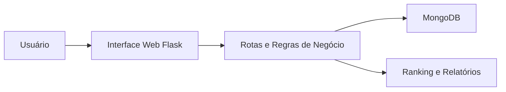
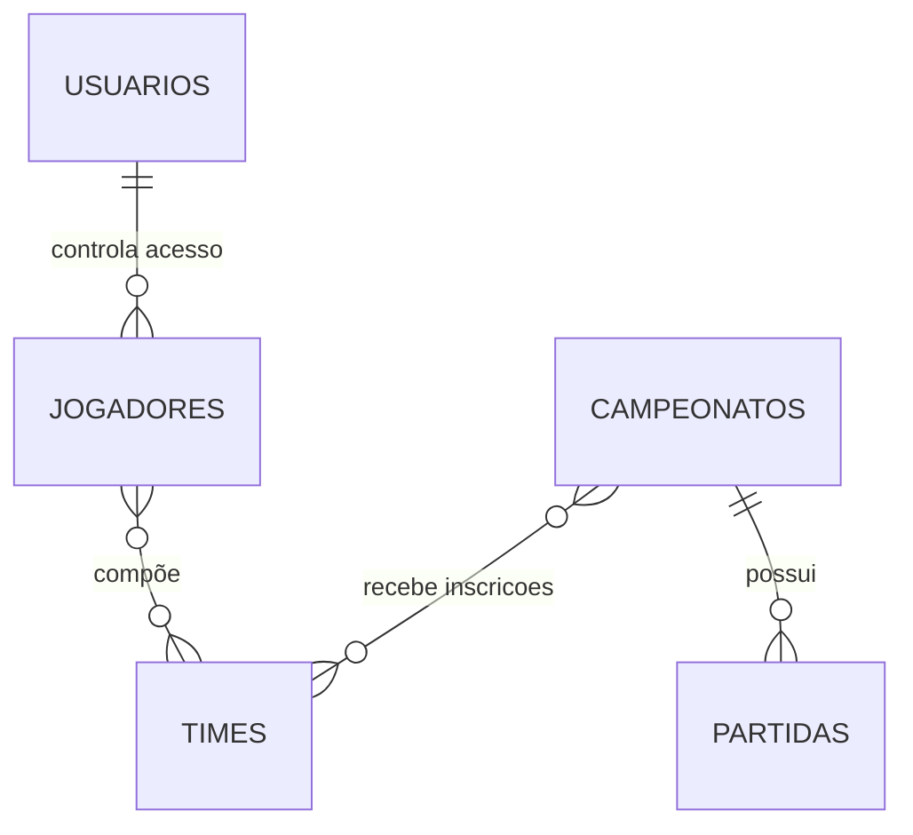

# Arquitetura e Engenharia de Dados - FPS Arena

## Stack

- Backend: Python + Flask
- Banco de Dados: MongoDB
- Interface: HTML + CSS + Jinja2
- Segurança: bcrypt para senhas

## Visão Geral da Arquitetura

## Camadas do Sistema

### Interface

- templates HTML renderizados pelo Flask
- páginas de login, dashboard, ranking, relatórios e CRUDs

### Aplicação

- validações
- autenticação
- regras de acesso por perfil
- regras de campeonato, inscrição e atualização

### Persistência

- coleções MongoDB voltadas ao MVP

## Entidades Principais

- usuários
- jogadores
- times
- campeonatos
- partidas

## Modelo de Dados de Alto Nível

## Relações Operacionais

- um campeonato recebe vários times
- um campeonato possui várias partidas
- um time é formado por vários jogadores
- usuários controlam autenticação e perfis

## Justificativa Técnica

- Flask simplifica a construção do MVP acadêmico
- MongoDB atende bem ao modelo já utilizado pelo grupo
- templates server-side reduzem complexidade de frontend neste momento
- a arquitetura favorece evolução incremental do produto
