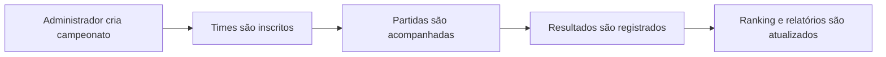

# UX - Wireframes do FPS Arena

## Objetivo

Apresentar os fluxos principais do produto de forma visual, priorizando as telas que representam o diferencial competitivo do sistema.

## Telas Selecionadas

### 1. Dashboard do Campeonato

Objetivo:

- dar visão rápida da operação
- mostrar métricas do sistema
- evidenciar últimos campeonatos

### 2. Gestão de Campeonato

Objetivo:

- visualizar informações do torneio
- acompanhar inscrições
- controlar status operacional

### 3. Partidas e Confrontos

Objetivo:

- exibir o andamento competitivo
- mostrar fases, confrontos e resultados registrados

### 4. Ranking Geral

Objetivo:

- permitir acompanhamento de desempenho
- reforçar o valor para jogadores e público

## Arquivo Visual

Para apresentação em sala, utilizar:

- [ux-wireframes.html](C:/Users/jonat/Downloads/TDE%20banco_avancado%201/fps_arena/docs/ux-wireframes.html)

Esse arquivo contém wireframes visuais de apoio para as quatro telas principais.

## Fluxo Principal do Usuário

